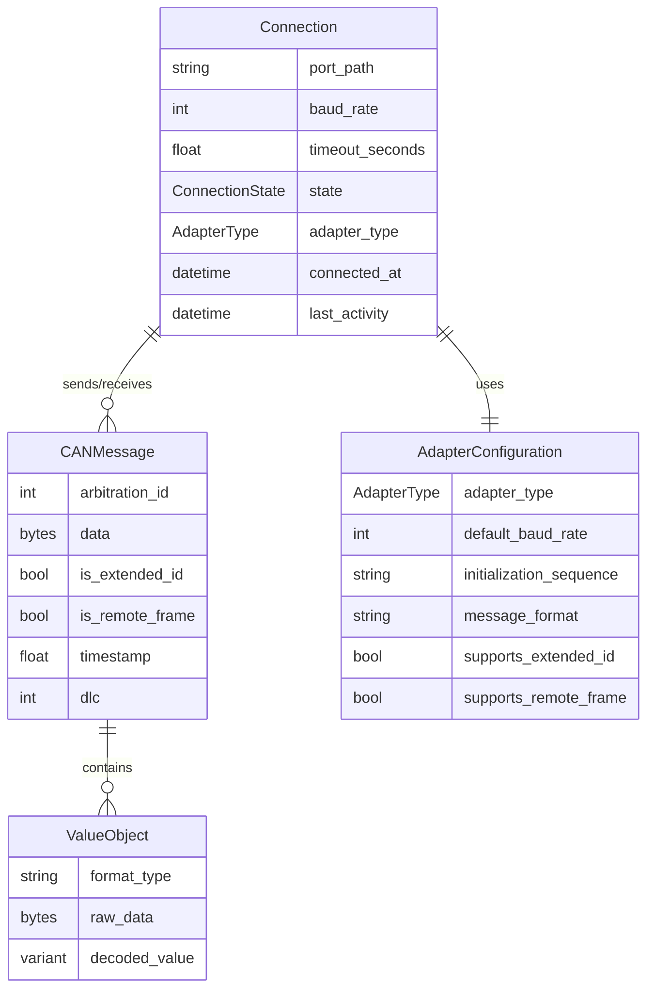

# Data Model: CAN over USB Serial Connection

**Feature**: 001-can-usb-serial
**Created**: 2025-10-24
**Status**: Design Phase

## Overview

This document defines the domain model for CAN bus communication via USBtin adapter. The model focuses on three core concepts: **CAN Messages** (protocol data units), **Connections** (serial port lifecycle), and **Value Encoding** (data representation). This is a domain model, not an implementation guide.

---

## Entity Relationship Diagram



---

## Core Entities

### 1. CAN Message

A CAN Message represents a single protocol data unit transmitted on the CAN bus. Messages are immutable once created and contain all metadata needed for transmission and interpretation.

#### Fields

| Field | Type | Constraints | Description |
|-------|------|-------------|-------------|
| `arbitration_id` | `int` | 0x000-0x7FF (standard)<br>0x00000000-0x1FFFFFFF (extended) | CAN identifier determining message priority and function |
| `data` | `bytes` | 0-8 bytes | Message payload containing parameter values |
| `is_extended_id` | `bool` | - | True for 29-bit extended frame (CAN 2.0B), False for 11-bit standard frame (CAN 2.0A) |
| `is_remote_frame` | `bool` | - | True for Remote Transmission Request (RTR), False for data frame |
| `timestamp` | `float` | ≥ 0 | Unix timestamp of message reception (None for outbound messages) |
| `dlc` | `int` | 0-8 | Data Length Code - number of bytes in payload (derived from `len(data)`) |

#### Validation Rules

1. **Arbitration ID Range**:
   - Standard frame (11-bit): `0 ≤ arbitration_id ≤ 0x7FF`
   - Extended frame (29-bit): `0 ≤ arbitration_id ≤ 0x1FFFFFFF`
   - **Violation**: Raise `ValueError` with specific range for frame type

2. **Data Payload**:
   - Type: Must be `bytes` (not `str`, `list`, or other)
   - Length: `0 ≤ len(data) ≤ 8`
   - **Violation**: Raise `TypeError` for wrong type, `ValueError` for length

3. **Remote Frame Constraint**:
   - Remote frames: `is_remote_frame=True` requires `len(data) == 0`
   - **Violation**: Raise `ValueError("Remote frames cannot contain data")`

4. **Timestamp Semantics**:
   - Outbound messages: `timestamp = None`
   - Inbound messages: `timestamp` set at reception time
   - Must be monotonically increasing for messages from same source

#### Relationships

- **Connection** (1:N): Each message is sent/received via exactly one Connection
- **ValueObject** (1:N): Message `data` field may contain multiple encoded values

---

### 2. Connection

A Connection represents the active communication channel between the host system and the CAN adapter. It manages the serial port lifecycle, tracks connection health, and enforces communication protocols.

#### Fields

| Field | Type | Constraints | Description |
|-------|------|-------------|-------------|
| `port_path` | `string` | Non-empty, valid path | Operating system path to serial device |
| `baud_rate` | `int` | Standard rates | Serial communication speed (default: 115200) |
| `timeout_seconds` | `float` | 0.1-60.0 | Maximum wait time for device responses (default: 5.0) |
| `state` | `ConnectionState` | Enum | Current connection status |
| `adapter_type` | `AdapterType` | Enum | Hardware adapter type |
| `connected_at` | `datetime` | None or valid | Time when connection was established |
| `last_activity` | `datetime` | None or ≥ connected_at | Time of last successful operation |

#### State Transitions

```
    [CLOSED]
       │
       │ connect()
       ↓
   [CONNECTING]
       │
       │ init success
       ↓
   [CONNECTED]
       │
       │ disconnect() or error
       ↓
   [CLOSING]
       │
       ↓
   [CLOSED]
```

---

### 3. Value Objects

#### Temperature Value

Represents temperature measurements with three encoding formats:

| Format | Size | Factor | Range | Example |
|--------|------|--------|-------|---------|
| `temp` | 2 bytes | 0.1 | -3276.8°C to +3276.7°C | `b'\x01\x23'` = 29.1°C |
| `temp_byte` | 1 byte | 0.5 | 0°C to 127.5°C | `b'\x2D'` = 22.5°C |
| `temp_uint` | 1 byte | 1.0 | 0°C to 255°C | `b'\x3C'` = 60°C |

#### Integer Value

Multi-byte integers in big-endian byte order (1, 2, 4, or 8 bytes).

---

## Enumerations

### ConnectionState
```
CLOSED       # Port not open
CONNECTING   # Opening port, initializing
CONNECTED    # Ready for communication
ERROR        # Unrecoverable error
CLOSING      # Clean shutdown in progress
```

### AdapterType
```
USBTIN       # USBtin SLCAN adapter
SOCKETCAND   # socketcand TCP/IP adapter (future)
```

### TemperatureFormat
```
temp         # 2 bytes, factor 0.1
temp_byte    # 1 byte, factor 0.5
temp_uint    # 1 byte, factor 1.0
```

---

## Domain Rules

### Message Priority
CAN arbitration ID determines bus priority - **lower IDs have higher priority**.

### Timing Constraints
- **Message Timeout**: 5 seconds (FR-005)
- **Connection Establishment**: < 2 seconds (SC-001)
- **Throughput**: ≥ 100 messages/second (SC-005)

### Resource Lifecycle
1. Connection MUST be opened before sending messages
2. Connection MUST be closed when no longer needed
3. Messages MUST be validated before transmission
4. Resources MUST be released in all termination scenarios

---

## References

- **CAN 2.0A/2.0B Specification**: ISO 11898-1:2015
- **SLCAN Protocol**: Lawicel AB ASCII protocol
- **Feature Specification**: `/specs/001-can-usb-serial/spec.md`
- **Research Document**: `/specs/001-can-usb-serial/research.md`
